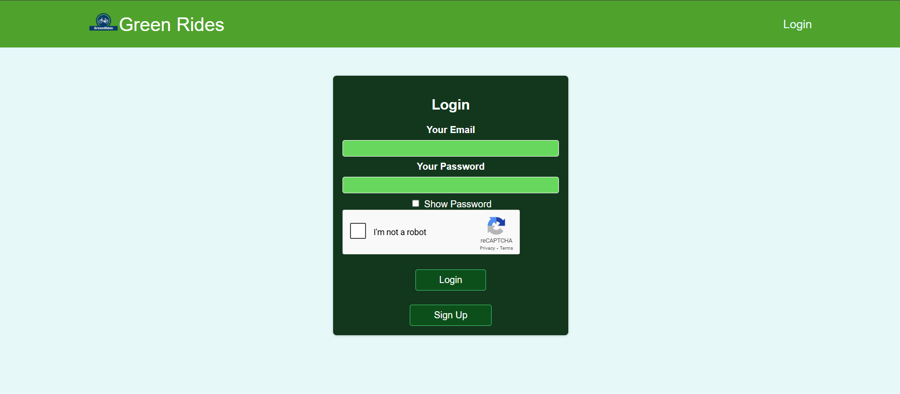
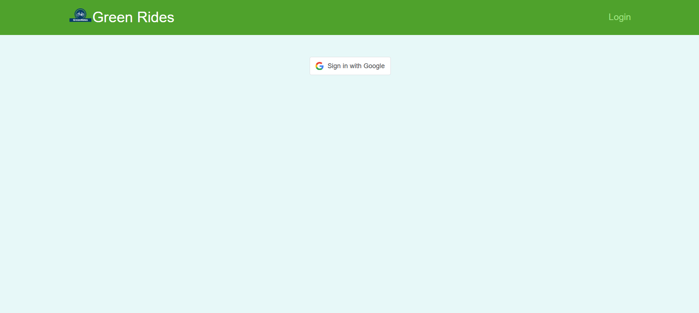

# 🚴 The Green Rides

**A Smart Cycle Rental Platform for Educational Institutions**

The Green Rides is a modern, eco-friendly cycle rental system designed specifically for students and educational institutions. The platform enables seamless bike rentals through QR code scanning, making sustainable transportation accessible and convenient for campus life.

---

## 📖 Table of Contents

- [🌟 Overview](#-overview)
- [✨ Key Features](#-key-features)
- [🎯 User Roles](#-user-roles)
- [📱 Platform Screenshots](#-platform-screenshots)
- [🏗️ System Architecture](#️-system-architecture)
- [🛠️ Technology Stack](#️-technology-stack)
- [⚙️ Installation & Setup](#️-installation--setup)
- [🚀 Getting Started](#-getting-started)
- [📋 API Documentation](#-api-documentation)
- [🔐 Authentication & Security](#-authentication--security)
- [🌍 Environment Variables](#-environment-variables)
- [🧪 Testing](#-testing)
- [📈 Future Enhancements](#-future-enhancements)
- [🤝 Contributing](#-contributing)

---

## 🌟 Overview

The Green Rides addresses the growing need for sustainable transportation solutions in educational institutions. By providing an easy-to-use digital platform for cycle rentals, we promote eco-friendly commuting while reducing traffic congestion on campus.

### 🎯 Problem Statement

- Limited transportation options for students within campus
- Need for eco-friendly transportation alternatives
- Manual cycle rental processes are time-consuming and inefficient
- Lack of real-time tracking for cycle availability and usage

### 💡 Solution

A comprehensive digital platform that enables:

- **QR Code-based rentals** for quick and contactless transactions
- **Role-based access control** for students, guards, and administrators
- **Real-time cycle tracking** and availability monitoring
- **Streamlined user management** through admin dashboard

---

## ✨ Key Features

### 🔍 **QR Code Integration**

- **Instant Rental**: Students scan QR codes on cycles to rent instantly
- **Easy Return**: Guards scan the same QR code to mark cycles as returned
- **Contactless Process**: Completely touchless rental and return system

### 👥 **Multi-Role Management**

- **Students**: Rent cycles, view rental history, manage profile
- **Guards**: Handle cycle returns, monitor cycle status
- **Administrators**: Complete system management and user oversight

### 📊 **Real-time Tracking**

- Live cycle availability status
- Rental duration tracking
- User activity monitoring
- System analytics and reporting

### 🛡️ **Security & Authentication**

- Google OAuth integration for secure login
- JWT-based session management
- Role-based access control
- reCAPTCHA protection against bots

---

## 🎯 User Roles

### 👨‍🎓 **Student**

**Primary Users of the Platform**

**Capabilities:**

- Register using Google OAuth
- Rent available cycles by scanning QR codes
- View current rental status
- Update profile information
- Change password securely

**User Journey:**

1. Login with Google account
2. Navigate to rental page
3. Scan QR code on desired cycle
4. Confirm rental
5. Use cycle for transportation
6. Return to guard when done

---

### 🛡️ **Guard**

**Cycle Return Management**

**Capabilities:**

- Scan QR codes to process cycle returns
- Monitor cycle status in real-time
- Handle multiple return requests
- View return history

**User Journey:**

1. Login to guard dashboard
2. Navigate to return page
3. Scan returned cycle's QR code
4. Confirm cycle condition
5. Complete return process

---

### 👨‍💼 **Administrator**

**Complete System Management**

**Capabilities:**

- **User Management:**
  - Add new students and guards
  - Remove users from system
  - Monitor user activities
- **Cycle Management:**
  - Add new cycles to fleet
  - Remove damaged/old cycles
  - Monitor cycle status and location
- **System Oversight:**
  - View platform analytics
  - Manage system configurations
  - Handle support requests

---

## 📱 Platform Screenshots

### 🏠 **Landing & Authentication**

#### Login Screen



Features shown:

- Clean, intuitive login interface
- Google OAuth button
- reCAPTCHA integration
- Responsive design

---

#### Registration Process



Features shown:

- Google account information pre-fill
- Role selection
- Terms and conditions acceptance

---

### 👨‍🎓 **Student Dashboard**

#### Student Profile

_[Screenshot Placeholder: Student dashboard overview]_

Features shown:

- Current rental status
- Profile information
- Quick access to rental function
- Recent activity history

---

#### QR Code Scanner (Student)

_[Screenshot Placeholder: QR scanning interface for rentals]_

Features shown:

- Camera view for QR scanning
- Scan confirmation dialog
- Error handling for invalid codes
- Rental success confirmation

---

#### Rental Confirmation

_[Screenshot Placeholder: Successful rental confirmation screen]_

Features shown:

- Cycle details
- Rental timestamp
- Expected return instructions
- Contact information for support

---

### 🛡️ **Guard Interface**

#### Guard Dashboard

_[Screenshot Placeholder: Guard control panel]_

Features shown:

- Return processing interface
- Active rentals overview
- Quick scan functionality
- Daily activity summary

---

#### QR Code Scanner (Guard)

_[Screenshot Placeholder: Guard QR scanning interface for returns]_

Features shown:

- Return-specific scanning interface
- Cycle condition assessment
- Return confirmation process
- Batch return capabilities

---

### 👨‍💼 **Admin Panel**

#### Admin Dashboard

_[Screenshot Placeholder: Comprehensive admin overview]_

Features shown:

- User statistics
- Cycle fleet status
- System health metrics
- Quick action buttons

---

#### User Management

_[Screenshot Placeholder: User management interface]_

Features shown:

- User list with roles
- Add/remove user functionality
- User activity monitoring
- Role management tools

---

#### Cycle Management

_[Screenshot Placeholder: Cycle fleet management]_

Features shown:

- Cycle inventory overview
- Add/remove cycle functionality
- Cycle status tracking
- Maintenance scheduling

---

#### Analytics Dashboard

_[Screenshot Placeholder: System analytics and reporting]_

Features shown:

- Usage statistics
- Popular routes/times
- User engagement metrics
- System performance indicators

---

## 🏗️ System Architecture

### **Frontend Architecture**

```
Frontend (React + Vite)
├── Authentication Layer (Google OAuth + JWT)
├── Role-based Routing
├── QR Code Integration (@zxing/library)
├── State Management (React Context)
└── API Integration (Axios)
```

### **Backend Architecture**

```
Backend (Node.js + Express)
├── Authentication Middleware
├── Role-based Access Control
├── RESTful API Endpoints
├── Database Layer (MongoDB)
└── Security Layer (CORS, Helmet, Rate Limiting)
```

### **Database Schema**

```
MongoDB Collections:
├── Users (Students, Guards, Admins)
├── Cycles (Fleet Management)
├── Rentals (Transaction Records)
└── System Logs (Audit Trail)
```

---

## 🛠️ Technology Stack

### **Frontend**

| Technology                 | Purpose          | Version |
| -------------------------- | ---------------- | ------- |
| **React**                  | UI Framework     | 18.3.1  |
| **Vite**                   | Build Tool       | 5.4.8   |
| **React Router**           | Navigation       | 5.3.4   |
| **Axios**                  | HTTP Client      | 1.7.7   |
| **@zxing/library**         | QR Code Scanning | 0.21.3  |
| **React Google reCAPTCHA** | Bot Protection   | 3.1.0   |
| **@react-oauth/google**    | Authentication   | 0.12.2  |

### **Backend**

| Technology     | Purpose               | Version    |
| -------------- | --------------------- | ---------- |
| **Node.js**    | Runtime Environment   | Latest LTS |
| **Express.js** | Web Framework         | Latest     |
| **MongoDB**    | Database              | Latest     |
| **Mongoose**   | ODM                   | Latest     |
| **JWT**        | Authentication        | Latest     |
| **bcryptjs**   | Password Hashing      | Latest     |
| **CORS**       | Cross-Origin Requests | Latest     |

### **Development Tools**

| Tool         | Purpose            |
| ------------ | ------------------ |
| **ESLint**   | Code Linting       |
| **Prettier** | Code Formatting    |
| **Yarn**     | Package Management |
| **Git**      | Version Control    |

---

## ⚙️ Installation & Setup

### **Prerequisites**

- Node.js (v16 or higher)
- MongoDB (local or cloud instance)
- Yarn package manager
- Git

### **1. Clone Repository**

```bash
git clone https://github.com/harshitpandey-dev/The-Green-Rides.git
cd The-Green-Rides
```

### **2. Backend Setup**

```bash
cd backend
yarn install

# Create environment file
cp .env.example .env
# Configure your environment variables (see Environment Variables section)

# Start MongoDB service
# For local: mongod
# For cloud: Ensure connection string is correct

# Start backend server
yarn dev
```

### **3. Frontend Setup**

```bash
cd frontend
yarn install

# Create environment file
cp .env.example .env
# Configure your environment variables

# Start development server
yarn dev
```

### **4. Access Application**

- Frontend: `http://localhost:5173`
- Backend API: `http://localhost:5000`

---

## 🚀 Getting Started

### **For Students**

1. **Registration**: Use your institutional Google account to register
2. **Find a Cycle**: Locate an available cycle on campus
3. **Scan QR Code**: Use the app to scan the cycle's QR code
4. **Enjoy Your Ride**: The cycle is now rented to you
5. **Return**: Find a guard to scan the QR code when returning

### **For Guards**

1. **Login**: Use provided credentials to access guard interface
2. **Return Processing**: Scan QR codes when students return cycles
3. **Monitor Status**: Keep track of cycle conditions and availability

### **For Administrators**

1. **System Access**: Login with admin credentials
2. **User Management**: Add/remove students and guards
3. **Fleet Management**: Add new cycles, remove damaged ones
4. **Monitor Analytics**: Track system usage and performance

---

## 📋 API Documentation

### **Authentication Endpoints**

```
POST /api/auth/register    # User registration
POST /api/auth/login       # User login
PUT  /api/auth/change-password  # Password update
```

### **User Management**

```
GET    /api/users/me       # Get current user
POST   /api/users          # Create new user (admin only)
```

### **Cycle Management**

```
GET    /api/cycles         # Get all cycles
POST   /api/cycles         # Add new cycle (admin only)
PUT    /api/cycles/:id     # Update cycle (admin only)
DELETE /api/cycles/:id     # Remove cycle (admin only)
```

### **Rental Management**

```
GET    /api/rentals              # Get all rentals
POST   /api/rentals              # Create new rental
PUT    /api/rentals              # Complete rental (return)
GET    /api/rentals/getByUser    # Get user's active rental
```

---

## 🔐 Authentication & Security

### **OAuth Integration**

- Google OAuth 2.0 for secure authentication
- No password storage for OAuth users
- Institutional email verification

### **JWT Security**

- Secure token-based authentication
- Automatic token expiration
- Refresh token mechanism

### **Data Protection**

- Password hashing with bcrypt
- Input validation and sanitization
- CORS configuration
- Rate limiting on API endpoints

### **Role-Based Access**

- Three-tier access control (Student/Guard/Admin)
- Protected routes based on user roles
- API endpoint authorization

---

## 🌍 Environment Variables

### **Frontend (.env)**

```env
# API Configuration
VITE_API_ENDPOINT=http://localhost:5000/api

# Google OAuth
VITE_GOOGLE_CLIENT_ID=your_google_client_id

# reCAPTCHA
VITE_GOOGLE_RECAPTCHA_SITE_KEY=your_recaptcha_site_key
```

### **Backend (.env)**

```env
# Database
MONGO_URI=mongodb://localhost:27017/green-rides

# JWT Secret
JWT_SECRET=your_super_secret_jwt_key

# Server Configuration
PORT=5000
NODE_ENV=development

# Google OAuth (for backend validation)
GOOGLE_CLIENT_ID=your_google_client_id
GOOGLE_CLIENT_SECRET=your_google_client_secret
```

---

## 🧪 Testing

### **Frontend Testing**

```bash
cd frontend
yarn test              # Run test suite
yarn test:coverage     # Run tests with coverage
yarn test:watch        # Run tests in watch mode
```

### **Backend Testing**

```bash
cd backend
yarn test              # Run API tests
yarn test:integration  # Run integration tests
yarn test:unit         # Run unit tests
```

### **E2E Testing**

```bash
yarn test:e2e          # Run end-to-end tests
```

---

## 📈 Future Enhancements

### **Phase 2 Features**

- [ ] **Mobile Application** (React Native)
- [ ] **GPS Tracking** for cycles
- [ ] **Payment Integration** for premium features
- [ ] **Booking System** for advance reservations
- [ ] **Maintenance Scheduling** automation

### **Phase 3 Features**

- [ ] **AI-powered Analytics** for usage optimization
- [ ] **IoT Integration** for smart locks
- [ ] **Route Optimization** suggestions
- [ ] **Carbon Footprint Tracking**
- [ ] **Gamification** elements for user engagement

### **Technical Improvements**

- [ ] **Progressive Web App** capabilities
- [ ] **Offline Mode** support
- [ ] **Push Notifications**
- [ ] **Advanced Caching** strategies
- [ ] **Microservices Architecture**

---

## 🤝 Contributing

We welcome contributions from the community! Here's how you can help:

### **Getting Started**

1. Fork the repository
2. Create a feature branch (`git checkout -b feature/amazing-feature`)
3. Commit your changes (`git commit -m 'Add amazing feature'`)
4. Push to the branch (`git push origin feature/amazing-feature`)
5. Open a Pull Request

### **Contribution Guidelines**

- Follow the existing code style
- Write clear commit messages
- Add tests for new features
- Update documentation as needed
- Ensure all tests pass before submitting

### **Areas for Contribution**

- 🐛 Bug fixes
- ✨ New features
- 📚 Documentation improvements
- 🎨 UI/UX enhancements
- ⚡ Performance optimizations
- 🧪 Test coverage expansion

---

## 👨‍💻 Project Team

**Harshit Pandey** - _Lead Developer_

- GitHub: [@harshitpandey-dev](https://github.com/harshitpandey-dev)

---

**Made with ❤️ for a greener future** 🌱

---

_Last Updated: August 2025_
